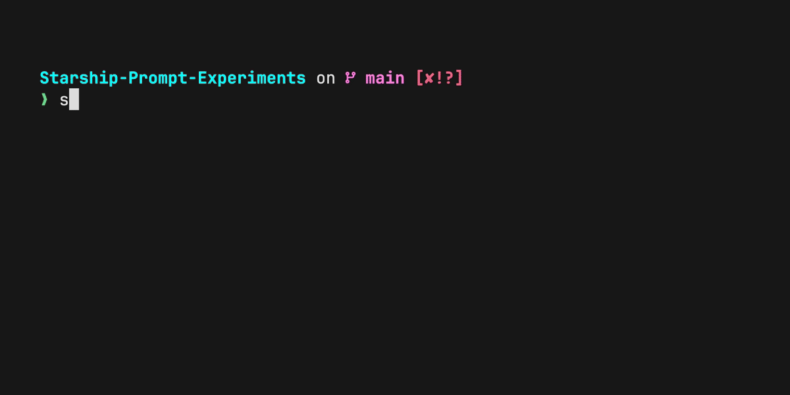

# Starship Prompt Experiments

> This repo is a compendium of utilities and lessons learned playing around with Starship configuration.

## Neat Script to check what other configuration looks like and set Starship to it.

The script ´scripts/prompt_selector.zsh´ allows an easy interface to update Starship configuration on the fly. Main configuration will not be updated until final approval, so on unsuccessfull or interrupted runs, the original prompt will remain as the current one.

## Starship insights

Prompt setup for terminals based on Nerd-Fonts and Starship prompt.

Starship usefull comands to explore what is being displayed:

    - starship explain
    - starship ignore

Use:

    export STARSHIP_CONFIG=~/example/non/default/path/starship.toml

To assign a configuration file.

